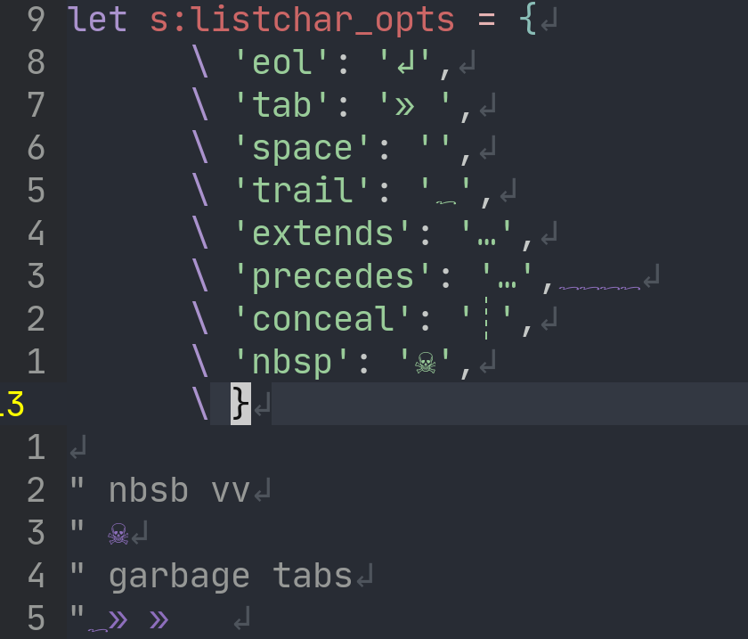

# cyclist.vim

cycle + listchars = cyclist.vim



## Example Uses

```vim
" You can change it on autocmds, using saved configurations.
augroup ChangeListChars
  au!
  au FileType C :call cyclist#activate_listchars('c_listchars')<CR>
augroup END
```

## Possible configurations

```vim
" TRAIL
" U+2591
call cyclist#set_trail('default', '░')

" interrobang, credit @stupac62
call cyclist#set_trail('default', '‽')

" PRECEDES & EXTENDS
call cyclist#set_preceds('default', '☚')
call cyclist#set_extends('default', '☛')
```
